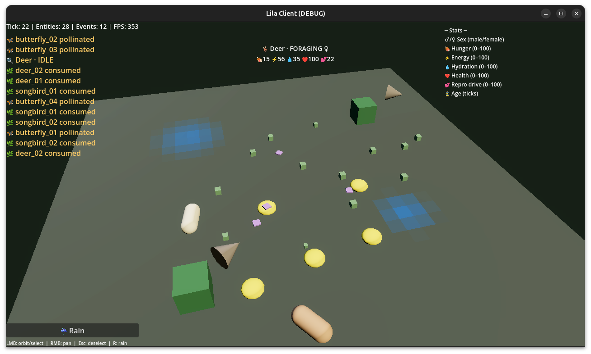

# līlā — Godot 3D Client

Godot 4.7 3D client for the [līlā](../../README.md) ecosystem simulation engine. Connects to a running worker via WebSocket, visualizes the world in real time with 3D primitives, and runs client-side agency between server ticks.

## Quick Start

```bash
# 1. Run the server (in another terminal)
cd ../../server
uv run python -m ecosim.worker --port 8001

# 2. Open this folder in Godot 4.7+ and press F5
```

The client connects to `localhost:8001` by default. Change the server address in `scripts/constants.gd` (`DEFAULT_HOST` / `DEFAULT_PORT`) or pass it via scene properties on the `WS` autoload.

## Controls

| Input | Action |
|-------|--------|
| **LMB drag** | Orbit camera / Select entity |
| **RMB drag** | Pan camera |
| **Scroll** | Zoom |
| **Esc** | Deselect entity |
| **R** | Trigger rain event |
| **☔ Rain (HUD)** | Trigger rain event |

## Architecture

```
┌──────────────────────────────────────────────┐
│  Godot Main Loop (60 Hz)                     │
│                                              │
│  ┌──────────┐    ┌───────────┐               │
│  │ Agency   │    │ Renderer  │               │
│  │ (60 Hz)  │    │ (60 Hz)   │               │
│  └────┬─────┘    └────▲──────┘               │
│       │               │                      │
│       │ emit events   │ draw entities        │
│       ▼               │                      │
│  ┌──────────┐         │                      │
│  │ World    │─────────┘                      │
│  │ Model    │                                │
│  └────┬─────┘                                │
│       │                                      │
│  ┌────▼──────┐                               │
│  │Heartbeat  │── 1 Hz ──► client events      │
│  └───────────┘                               │
│                                              │
│  ┌──────────────┐                            │
│  │ WS Client    │ ◄── WebSocket ─── Worker   │
│  │ (autoload)   │    /ws :8001               │
│  └──────────────┘                            │
└──────────────────────────────────────────────┘
```

### Key Modules

| File | Purpose |
|------|---------|
| `scenes/main.tscn` | Main scene — 3D world, camera, HUD, lighting |
| `scenes/main.gd` | Scene root — setup, tick handling, selection, rain |
| `scripts/autoloads/ws_client.gd` | WebSocket client — connects to server `/ws`, loads `/world.json`, auto-reconnects |
| `scripts/autoloads/world_model.gd` | Client-side world model — entity registry, spatial queries, environment state |
| `scripts/agency.gd` | Client-side agency engine — behavior priority chains for mobile entities (animals, birds, insects) |
| `scripts/reconciliation.gd` | Position reconciliation — smooth correction of client-agency positions toward server reference positions |
| `scripts/heartbeat.gd` | Heartbeat sender — serializes client events and sends at 1 Hz |
| `scripts/particles.gd` | Particle system — visual effects for consumption, death, pollination events |
| `scripts/renderer.gd` | 3D renderer — `MultiMeshInstance3D` per entity type with grid-based ground rendering |
| `scripts/camera/orbit_camera.gd` | Orbit camera — LMB orbit, RMB pan, scroll zoom |
| `scripts/constants.gd` | Shared constants — grid dimensions, tick rates, colors, cooldowns |
| `resources/world.json` | Local copy of the world definition (used on first connect) |
| `resources/shaders/` | Shader materials for ground and entity rendering |
| `scenes/hud.tscn` | HUD overlay — stats, event log, help text, entity selection info |

### Client-Side Agency

The Godot client runs the same agency model as the browser and Python clients:

1. **Behavior priority chain** — each mobile entity evaluates behaviors in order: fleeing → drinking → mate-seeking → foraging/hunting → pollinating → wandering
2. **Client events** — when an interaction occurs (predation, consumption, pollination, reproduction), the client emits an event via heartbeat
3. **Server acknowledgment** — the server validates client events against eligibility flags and either acknowledges (accepting the outcome) or rejects (forcing reconciliation)

### Reconciliation

When client-agency positions diverge from server reference positions beyond a threshold:

1. The ref position is enqueued as a reconcile target
2. The agency system smoothly meanders toward it over ~2 seconds
3. Each entity has a unique sync personality (`sync_phase`, `sync_speed`) to stagger reconciliation and avoid synchronized snapping
4. A continuous gravity well gently pulls entities toward their ref position during normal agency

## Dependencies

| Requirement | Version |
|-------------|---------|
| Godot Engine | 4.7+ |
| Rendering | `gl_compatibility` (default, works on most GPUs) |

No external assets or plugins needed — everything uses Godot primitives and built-in shaders.

## Development

### Adding a New Entity Type

1. Add the type to `LilaConstants.TYPE_COLORS` in `constants.gd`
2. Add a species entry to `SPECIES_COLORS` if needed
3. Add a state entry to `STATE_COLORS` if the type has unique states
4. The renderer will auto-discover new types from the world definition

### Debugging

The HUD stats bar shows tick count, entity count, events processed, and FPS. The event log displays recent interaction events with color-coded BBCodes matching event types.

```bash
# Server-side debugging (view telemetry)
tail -f ~/.lila/logs/*.jsonl
```

## Screenshots



The client renders entities as colored 3D primitives (cubes, capsules, cylinders) on a voxel-based terrain. State is communicated through color tinting. Selection shows a highlight ring and species/drive info in the HUD billboard. The left panel shows real-time stats, an event log, and control hints. The top-right drive legend explains active behaviors for the selected species.
